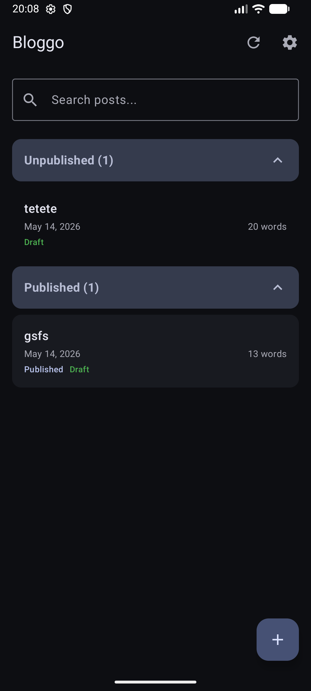
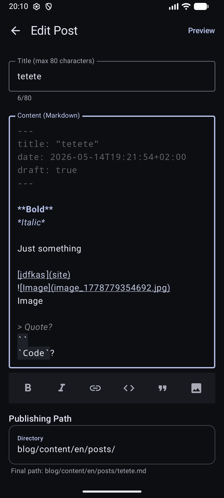
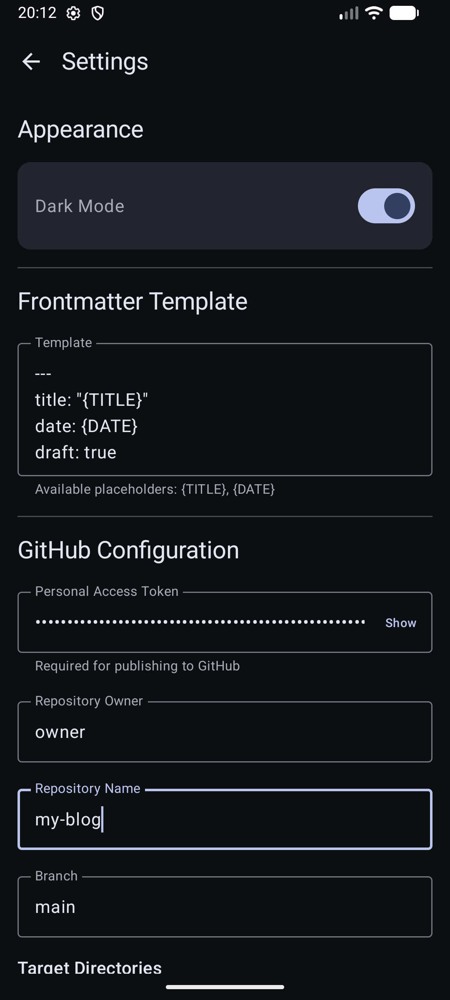

# BlogGo: an Android app to Blog on the Go

**Bloggo** is a lightweight Android application designed for bloggers who use Static Site Generators (SSGs) like Hugo. It allows you to write, preview, and publish Markdown posts directly to your GitHub repository from your mobile device.

See the article about the initial version [here](https://rrajath.com/posts/bloggo-an-android-app-to-blog-on-the-go/).

## Screenshots

| Main screen | Edit Post | Settings |
|:---:|:---:|:---:|
|  |  |  |

## Setup

1. Install the app:
   - either install it manually from **GitHub releases**;
   - or use [Obtainium](https://github.com/ImranR98/Obtainium) and add this repo as a source.
1. **GitHub access**: 
   - [create a Personal access token on GitHub](https://github.com/settings/personal-access-tokens/new); 
   - give it Read and Write access to code.
1. **Configuration**:
   - **Frontmatter template**: customize the default metadata added to every new post;
   - **GitHub PAT**: copy-paste the token your created here;
   - **Repository**: set username, repo and branch to commit;
   - **Target Directories**: the directory where your posts live (e.g., `content/posts/`). You can add multiple and select when you post.

---

## License
[MIT License](LICENSE)
