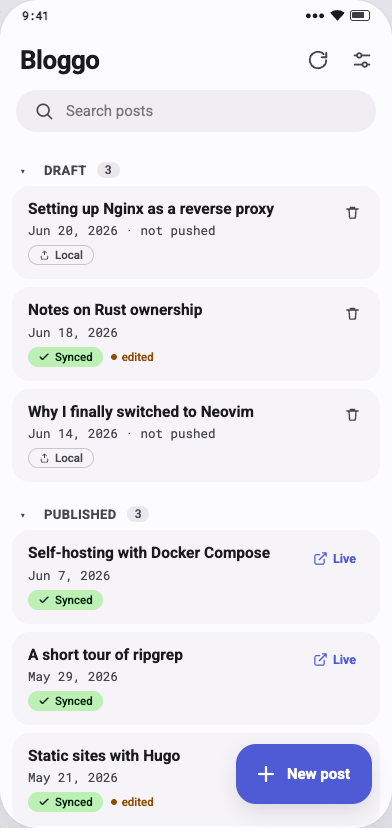
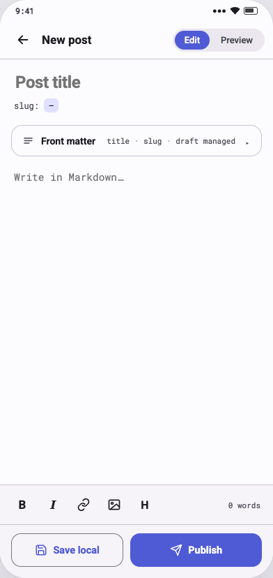
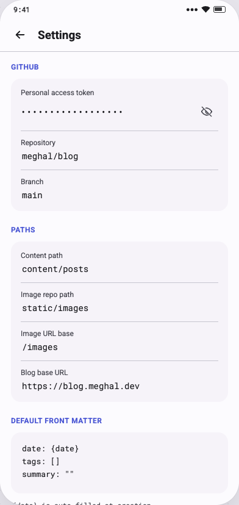

# Bloggo

**Bloggo** is an Android app for writing, previewing, and publishing [Hugo](https://gohugo.io/) blog posts directly from your phone. Posts are authored in Markdown with YAML front matter and pushed straight to your blog's GitHub repository — no laptop required.

---

## The Problem

Writing and publishing a blog post traditionally means sitting at a laptop to author, preview, commit, and push. There is no way to capture and publish a post when an idea strikes away from your desk. Bloggo removes that constraint: open the app, write in Markdown, check the preview, and publish — all from your phone.

---

## Features

- **Post list with instant loading** — see all posts (local and synced from GitHub) at a glance, grouped into Draft and Published sections
- **Markdown editor** — touch-friendly editor with bold, italic, link, image, and heading formatting shortcuts
- **Live Markdown preview** — toggle between Edit and Preview without leaving the editor
- **YAML front matter management** — title, slug, and draft status are managed automatically; everything else is freely editable
- **Auto-derived slugs** — slug is derived from the title on new posts; freezes permanently once pushed so live URLs never break
- **Save locally or publish** — save a draft to your device, or push directly to GitHub in a single flow with a commit diff to review before pushing
- **Draft-flip protection** — if a post is still marked `draft: true`, Bloggo warns you before publishing
- **Sync status indicators** — every post shows whether it is Local-only, Synced, or Synced-with-local-edits
- **Search** — filter posts by title from the home screen
- **Customisable appearance** — Light, Dark, and System theme modes with four accent colours (Indigo, Green, Amber, Violet)
- **Secure token storage** — your GitHub Personal Access Token is stored in Android's encrypted keystore

---

## Screenshots

| Home | Editor | Settings |
|------|--------|----------|
|  |  |  |

---

## Installation

### Download from GitHub Releases (recommended)

1. Open the [Releases](https://github.com/rrajath/bloggo/releases) page.
2. Download the latest `bloggo-release.apk`.
3. On your Android device, allow installation from unknown sources if prompted, then open the downloaded file to install.

### Via Obtainium

[Obtainium](https://github.com/ImranR98/Obtainium) lets you track and install updates automatically directly from GitHub Releases.

1. Install Obtainium on your device.
2. Tap **Add App** and enter the repository URL:
   ```
   https://github.com/rrajath/bloggo
   ```
3. Obtainium will detect new releases automatically and notify you when an update is available.

### Build from source

Prerequisites: JDK 17, Android SDK.

```bash
git clone https://github.com/rrajath/bloggo.git
cd bloggo
./gradlew assembleRelease
# APK is at app/build/outputs/apk/release/
```

---

## Setup

1. Install the app and open it.
2. Tap the **Settings** icon (top-right on the home screen).
3. Enter:
   - **Personal Access Token** — a GitHub PAT with `repo` scope (contents read/write)
   - **Repository** — your GitHub repo in `owner/repo` format
   - **Branch** — defaults to `main`
   - **Content path** — where your Markdown posts live (e.g. `content/posts`)
   - **Blog base URL** — used to generate "View live" links for published posts
4. Tap back to start writing.

---

## Architecture

Standard Android layered architecture built with Jetpack Compose and Material 3.

```
ui/        Compose screens (Home, Editor, Settings) + ViewModels
domain/    Pure Kotlin models (PostDraft, SyncState, FrontMatter, Slug)
data/      Repositories, Room DAOs, Retrofit (GitHub API), SettingsRepository
di/        Hilt modules
```

**Tech stack:** Kotlin · Jetpack Compose · Material 3 · Hilt · Room · Retrofit · Moshi · SnakeYAML · Markwon · DataStore · EncryptedSharedPreferences

---

## License

MIT
