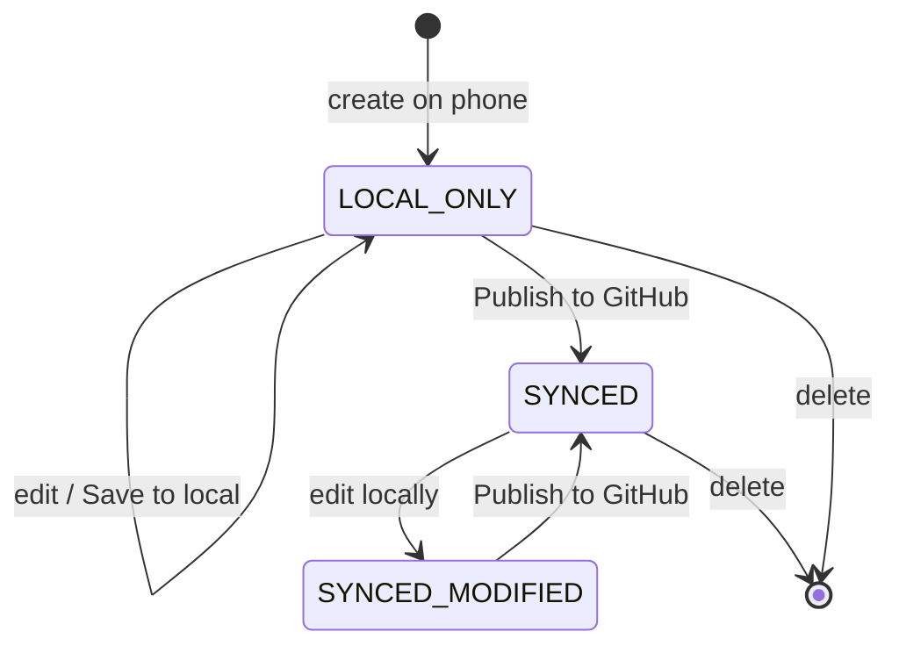

# HugoPad — Technical Design Document (v1)

> Companion to the PRD. Captures architecture and the design decisions worked through during planning. Platform: **Android, native — Kotlin + Jetpack Compose.**

---

## 1. Architecture overview

A standard layered Android app:

- **UI (Compose):** Home, Post Detail (editor), Settings. State-hoisted, driven by ViewModels.
- **Domain:** the `PostDraft` model, slug logic, front-matter assembly/parse, and the editor reconciliation rules. Pure Kotlin, framework-free.
- **Data:**
  - **Local cache & drafts** — Room.
  - **Secure config** — EncryptedSharedPreferences (PAT) backed by the Android Keystore.
  - **Remote** — GitHub REST API (Retrofit/Ktor + OkHttp).

The full domain model lives in `PostDraft.kt` (delivered separately); key pieces are reproduced below so this document stands alone.

---

## 2. Tech stack

| Concern | Choice | Notes |
|--------|--------|-------|
| UI | Jetpack Compose | |
| Async | Coroutines + Flow | |
| Local DB | Room | post cache + drafts |
| Secure storage | EncryptedSharedPreferences + Keystore | PAT only |
| HTTP | Retrofit or Ktor + OkHttp | GitHub API |
| YAML | kaml or SnakeYAML | **do not** parse front matter with regex |
| Markdown render | Markwon (or a Compose Markdown lib) | preview |
| Image resize | Android `Bitmap` / a resize lib | presets |

---

## 3. The two-axis state model

The two status axes are fully independent and must never be collapsed into one field.

```kotlin
// Axis 1: sync state -> home-screen TAG
enum class SyncState { LOCAL_ONLY, SYNCED, SYNCED_MODIFIED }

fun SyncState.tagLabel() = when (this) {
    SyncState.LOCAL_ONLY -> "Local"
    else -> "Synced"            // SYNCED_MODIFIED may add an "edited" dot
}

// Axis 2: draft flag -> home-screen SECTION
enum class HomeSection { DRAFT, PUBLISHED }
fun PostDraft.section() = if (draft) HomeSection.DRAFT else HomeSection.PUBLISHED
```

`section()` reads only `draft`; `tagLabel()` reads only `syncState`. Because neither references the other, every combination renders correctly — including a `draft: true` post that already exists on GitHub (Draft section, Synced tag).

### Post lifecycle



The slug auto-derive flag is `true` only in `LOCAL_ONLY`; crossing into `SYNCED` (or a manual slug edit) freezes it permanently.

---

## 4. The editor model

The editor's in-memory state is **not** a raw Markdown string. It is structured:

```kotlin
data class PostDraft(
    val localId: String,        // stable UUID; Room @PrimaryKey
    val repoPath: String?,      // "content/posts/my-post.md"; null until first push
    val blobSha: String?,       // GitHub blob SHA of last synced version; required to UPDATE
    val syncState: SyncState,

    // structured fields — source of truth for these three keys
    val title: String,
    val slug: String,
    val draft: Boolean,
    val slugAutoDerive: Boolean,

    // everything else, as the exact YAML the user edits (date, tags, custom keys)
    val rawFrontMatter: String,

    // markdown body ONLY — front matter is never stored here
    val body: String,

    val updatedAt: Long
)
```

### Why front matter is not in the body

Keeping front matter out of the body string kills three bug classes at once:

1. The title field can never clobber body text (they're separate state).
2. Preview is simply `render(body)` — there is nothing to strip, so "hide front matter in preview" is automatic.
3. There is no second copy of the title to drift out of sync.

The structured fields own `title`/`slug`/`draft`; the raw block owns the rest; the file is assembled at save time.

---

## 5. Slug derivation & reconciliation

```kotlin
fun slugify(title: String): String =
    title.trim().lowercase()
        .replace(Regex("[\u2019'\"]"), "")  // drop apostrophes/quotes
        .replace(Regex("[^a-z0-9]+"), "-")  // any run of non-alphanumerics -> single dash
        .replace(Regex("-+"), "-")           // collapse adjacent dashes
        .trim('-')
```

This satisfies both stated rules: spaces become dashes, and multiple adjacent dashes collapse to one (the run-based regex absorbs already-present dashes).

```kotlin
// On title -> body focus change (or title commit):
fun PostDraft.onTitleCommitted(newTitle: String): PostDraft {
    val derive = slugAutoDerive && syncState == SyncState.LOCAL_ONLY
    return copy(title = newTitle, slug = if (derive) slugify(newTitle) else slug)
}

// Hand-editing the slug permanently stops auto-derivation:
fun PostDraft.onSlugManuallyEdited(newSlug: String) =
    copy(slug = newSlug, slugAutoDerive = false)
```

Target filename: `<contentPath>/<slug>.md`.

---

## 6. Front matter assembly & parsing

**Assemble (on save).** Structured fields win; the app always emits `title`/`slug`/`draft` itself and appends the raw block. If an owned key appears in the raw block it is stripped and a warning surfaced — never emitted twice. The result is a `---`-fenced YAML block, a blank line, then the body.

**Parse (on load).** Split the `---` fence into front-matter YAML and body; parse the YAML with the chosen library; lift `title`/`slug`/`draft` into structured fields; re-serialize the remaining keys as the user-visible raw block. Posts loaded from GitHub arrive with `slugAutoDerive = false`.

> Use a real YAML library for parsing. Regex-based front-matter parsing is the most common failure point in apps like this — titles with colons, quoted values, and multi-line keys all break naive parsers.

**Format note:** front matter is **YAML** (`---` delimiters), consistent with the user's preference. (Their ox-hugo laptop exports may be TOML; phone-authored posts are a separate class and standardize on YAML.)

---

## 7. GitHub sync layer

**Listing posts.** Enumerate the content path with the **Git Trees API** (recursive), then fetch each file's content + blob SHA to read its front matter (needed for title and `draft:` status). Cache the results so Home paints instantly; pull-to-refresh re-runs this and **merges** results with local unpushed posts rather than replacing them.

**Creating a post.** `PUT` to the Contents API with base64 content, the commit message `New post: <title>`, the branch, and path `<contentPath>/<slug>.md`.

**Updating a post.** Same endpoint, but the request **must include the current blob SHA** of the file, or GitHub rejects the update. Fetch/track the SHA (`blobSha`) and refresh it before an update if stale.

**Commit message:** `New post: <post title>`.

**Auth & limits.** Authenticated PAT requests allow ~5,000/hour — comfortably within a single user's listing + commit volume. The token needs `contents:write` on the target repo.

**"View live" URL.** Built as `blogBaseUrl` + permalink. v1 assumes the default mapping (base URL + content section + slug); if the Hugo site uses a custom `permalinks` config, this becomes a configurable pattern in a later version.

---

## 8. Local persistence & caching

- `PostDraft` maps directly to a Room `@Entity` (`localId` as `@PrimaryKey`).
- The cache stores both local-only posts and a snapshot of remote posts (with `repoPath` + `blobSha`).
- Home reads from Room first (instant), then reconciles with a background GitHub refresh.
- **Autosave** writes the in-progress editor buffer to Room continuously — distinct from the explicit "Save to local," which promotes a post to a listed entry.

---

## 9. Security

- The **PAT** is stored in **EncryptedSharedPreferences** backed by the **Android Keystore**, never in Room or plaintext prefs.
- The Settings reveal toggle only affects on-screen rendering of the field; it does not change storage.
- Because the token can write to the repo, an **optional biometric app lock** is recommended.

---

## 10. Image pipeline

1. User picks an image and selects a size preset.
2. Resize to a fixed **max width** while preserving aspect ratio. Suggested mapping: **Small ≈ 480px**, **Medium ≈ 800px**, **Large ≈ 1600px**; re-encode (e.g. JPEG ~85%).
3. Commit the binary (base64) to the **image repo path** (e.g. `static/images`), handling filename collisions (timestamp/suffix).
4. Insert Markdown referencing the **public URL path** (e.g. `/images/<file>`), which differs from the repo path — `static/` is stripped by Hugo at serve time.

Repo path and URL base are **two separate settings** precisely because they differ.

---

## 11. Configuration model (Settings)

```
githubPat        (secure)     repository         branch (= "main")
contentPath                   imageRepoPath      imageUrlBase
blogBaseUrl                   frontMatterTemplate (date token auto-filled)
theme (light/dark/system)     appLock (optional, biometric)
```

---

## 12. Edge cases & failure handling

- **Refresh failure:** keep cached list, show a non-blocking banner; never drop local posts.
- **Stale SHA on update:** re-fetch the file SHA and retry; if the remote changed unexpectedly, surface the diff before overwriting.
- **Malformed front matter:** block publish at the validation step with a clear message.
- **Owned key typed into raw front matter:** strip on parse/save, structured field wins, warn the user.
- **Slug change attempts on synced posts:** disallowed by default (frozen) to protect live URLs.
- **App killed mid-edit:** autosave buffer restores the in-progress post.

---

## 13. Decisions log

| Decision | Resolution |
|---|---|
| Source-of-truth conflict with ox-hugo | Phone posts are start-and-finish only; never round-tripped through org. |
| Front matter format | YAML (`---`). |
| Home grouping | Section by `draft:`; tag by sync state (Local/Synced). |
| Front matter editing | Hybrid: structured title/slug/draft + collapsible raw block + separate body. |
| Slug auto-update | On title→body blur, local/unpushed only; frozen once synced or hand-edited. |
| Underline | Dropped (no native Markdown). |
| "Save as draft" naming | Renamed "Save to local"; never touches `draft:`. |
| Filename rule | `<slug>.md`. |
| Commit message | `New post: <title>`. |
| Preview | Renders body only; front matter hidden by construction. |

---

## 14. Out of scope (v1)

Syntax highlighting, Hugo shortcode quick-insert, scheduled publishing, custom permalink patterns, multi-repo support, full themed-site preview.
